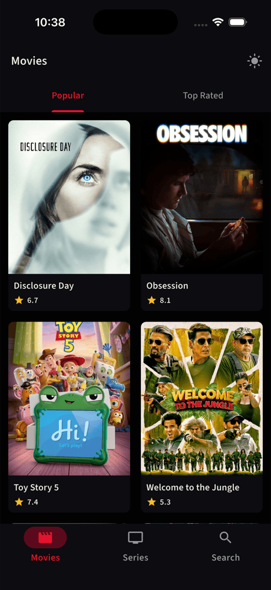
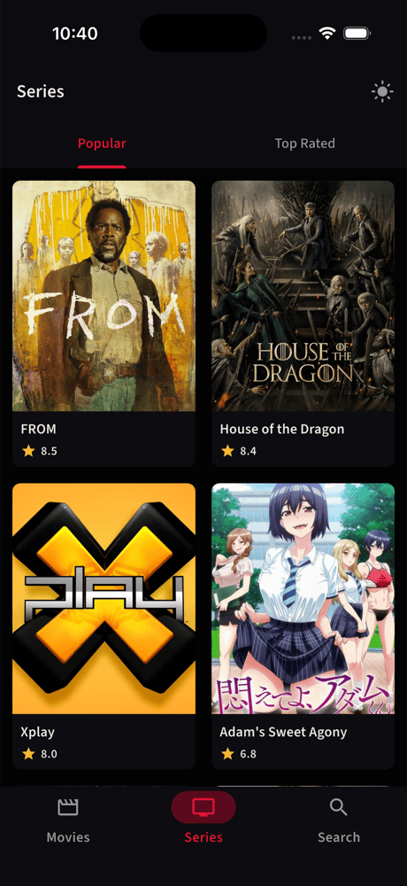

# 🎬 Movie Universe

🇪🇸 Versión en español · **[English README](README.en.md)**

App Flutter para descubrir **películas y series** populares, mejor valoradas y buscables con [The Movie Database (TMDB)](https://developer.themoviedb.org/) — **UI inmersiva**, búsqueda unificada y base **Clean Architecture** feature-first con **Riverpod**; **213 tests** automatizados.


---

## Vista previa

*Tema oscuro — UI cinematográfica en los flujos principales.*

| Películas | Detalle inmersivo | Búsqueda unificada | Series |
|:---------:|:-----------------:|:------------------:|:------:|
|  |  |  |  |
| Popular y Top Rated | Parallax · swipe-to-dismiss | Películas + Series · paginación | Misma UX de listado |

Alternancia claro/oscuro en runtime con `themeModeProvider`.

---

## Destacados

- **Shell de 3 tabs** — Películas · Series · Búsqueda con paginación infinita
- **Detalle inmersivo** — header colapsable, parallax, plantilla premium compartida
- **Búsqueda unificada** — resultados multi-media con filtros en memoria
- **UI dark-first** — capturas en tema oscuro; modo claro disponible
- **Ingeniería** — errores tipados, design system, tests de capas, CI en GitHub Actions

---

## Funcionalidades

### Implementado

| Funcionalidad | Estado |
|---------------|--------|
| Películas y series — Popular y Top Rated | ✅ |
| Detalle de película y/o serie | ✅ Pantallas inmersivas |
| Buscador por nombre (películas y series) | ✅ Búsqueda unificada + filtros |
| Tests automatizados | ✅ Repos, use cases, DTOs, providers, widget e integration |
| Ejemplo listado → detalle | ✅ Widget + integration tests |
| Scroll en listados | ✅ Paginación infinita (películas, series, búsqueda) |
| Scroll en detalles | ✅ Collapse de header, parallax, swipe-to-dismiss (widget tests) |
| Escalable / buenas prácticas | ✅ Clean Architecture, CI |

Además: tema claro/oscuro, manejo tipado de errores.

### Fase 2 — mejoras opcionales

Funcionalidades planeadas para una **siguiente iteración** del producto; la arquitectura actual ya permite agregarlas sin rediseño.

Favoritos, localización (UI multi-idioma), caché offline, títulos similares, reparto, push notifications, golden tests.

**Enfoque resumido:**

- **Favoritos** — feature `favorites/` con persistencia local; clave `MediaReference` + snapshot ligero; cuarto tab en el shell.
- **Offline** — repositorios compuestos (remoto + caché local); priorizar detalle visto y páginas de listado ya cargadas.
- **Localización** — textos de UI (tabs, errores, labels) con `flutter_localizations` + ARB; dominio sin cambios.

Detalle completo: [`docs/roadmap.md`](docs/roadmap.md).

---

## Stack tecnológico

| Tecnología | Uso |
|------------|-----|
| **Flutter 3.35.7+** | SDK del proyecto (verificado: **3.44.3**) |
| **Dart 3.12.2** | `sdk: ^3.12.2` en `pubspec.yaml` — Dart **embebido** en el Flutter SDK; no comparte numeración con Flutter (no existe “Dart 3.35.7”, suele confundirse con la versión de Flutter) |
| **Riverpod** | State management (sin Hooks) |
| **Freezed** | Modelos inmutables |
| **Fluro** | Navegación |
| Dio | API TMDB |
| Mocktail | Mocks en tests |

Detalle: [`docs/architecture.md`](docs/architecture.md) · [`docs/runtime-design.md`](docs/runtime-design.md).

---

## Cómo ejecutar

**Requisitos:** Flutter **3.35.7+** (verificado: 3.44.3) · Dart **`^3.12.2`** (verificado: 3.12.2) — ver [Stack tecnológico](#stack-tecnológico) para el detalle de Dart.

```bash
git clone https://github.com/Esteban37/movie-universe-app.git
cd movie-universe-app
flutter pub get
dart run build_runner build --delete-conflicting-outputs

cp .env.development.example .env.development
cp .env.development .env
# Edita .env.development: TMDB_ACCESS_TOKEN con tu token (ver .env.example)

flutter run
```

```bash
flutter test
flutter test integration_test
```

> **`build_runner` es obligatorio en un clone limpio** — los `*.freezed.dart` generados están en `.gitignore`.

---

## Documentación

El README es **bilingüe**; todo lo que está en `docs/` está en **inglés** (detalle técnico, OpenSpec, convenciones de ingeniería). Los mismos archivos se enlazan desde ambos README.

| Documento | Contenido |
|-----------|-----------|
| [`docs/architecture.md`](docs/architecture.md) | Capas, estructura, providers |
| [`docs/runtime-design.md`](docs/runtime-design.md) | API, red, estado, errores |
| [`docs/testing-strategy.md`](docs/testing-strategy.md) | Tests y CI |
| [`docs/ai-usage.md`](docs/ai-usage.md) | SDD, OpenSpec, Git, verificación |
| [`docs/roadmap.md`](docs/roadmap.md) | Funcionalidades planeadas |
| [`docs/openspec.md`](docs/openspec.md) | Workflow OpenSpec |
| [`AGENTS.md`](AGENTS.md) | Convenciones y guardrails de ingeniería |

Índice completo: [`docs/README.md`](docs/README.md).

---

## Uso de IA

> **Enfoque:** Desarrollo **spec-driven** con **OpenSpec** y **SDD**: definí la arquitectura (Clean Architecture feature-first, design system, tests de capas), alcance por change y criterios de aceptación en specs y `tasks.md`. La IA **aceleró** implementación, tests y borradores de documentación **a partir de ese contrato** — OpenCode y Cursor, distintos modelos, misma barra de calidad. Cada entrega la revisé antes de integrar: diff alineado a tareas, `dart analyze --fatal-warnings`, suite automatizada y revisión manual de UX.

### ¿Por qué SDD + OpenSpec?

**SDD (Spec-Driven Development)** acota el trabajo de la IA: implementa contra **indicaciones y specs que yo fijé**, no contra prompts abiertos. En la fase OpenCode usé **Context7 MCP** y **skills oficiales de Flutter/Dart** para anclar el modelo a documentación actual. **OpenSpec** materializa el flujo (proponer → aplicar → archivar) y permitió **evaluar modelos distintos** con **las mismas specs y el mismo checklist** antes de cada merge.

### ¿Qué decisiones de arquitectura tomé?

Definí y fui refinando, con criterio propio y referencias actuales del ecosistema Flutter:

- **Arquitectura:** Clean Architecture, capas, feature-first, `shared/domain`, contratos de repositorio y use cases
- **Patrones:** Repository, DI con Riverpod, paginación compartida, templates inmersivos, design system (Atomic Design)
- **Escalabilidad:** desacoplamiento cross-feature, specs OpenSpec por incremento, ramas `feat/*` + PR
- **Buenas prácticas:** errores tipados, tests de capas, CI, `dependency_validator`, preservación de UI premium

La IA **propuso implementaciones y borradores** dentro de ese marco; **ajusté, rechacé o reescribí** cuando no cumplía el diseño acordado.

### ¿Quién decide qué?

| Responsabilidad | Autor (criterio humano) | IA (asistente) |
|-----------------|-------------------------|----------------|
| Arquitectura, patrones, escalabilidad y buenas prácticas | ✅ Definición y refinamiento | Sugerencias / implementación acotada |
| Alcance, UX y prioridades | ✅ | — |
| Aprobación de merge a `main` | ✅ | — |
| Rechazar o corregir output incorrecto | ✅ | — |
| Propuesta de código/tests/docs desde specs | — | ✅ |
| Ejecutar tareas de `tasks.md` | — | ✅ |

### ¿Qué valido antes de cada merge?

Antes de integrar: diff alineado a `tasks.md` · `dart analyze --fatal-warnings` · `flutter test` · `flutter test test/architecture/` · `dart run dependency_validator` · revisión manual · **decisión explícita de merge**. La IA propone; **el merge es el visto bueno humano**.

### ¿Cómo se traza en Git?

Un OpenSpec change ≈ una rama `feat/*` ≈ un PR → `main`. El historial refleja **entregas incrementales revisadas**, no un volcado único generado por IA.

**Detalle** (specs, ramas, PRs, modelos, Context7/skills, checklist): **[`docs/ai-usage.md`](docs/ai-usage.md)**

---

## Autor

**Esteban Serrano** — Senior Mobile Software Engineer
